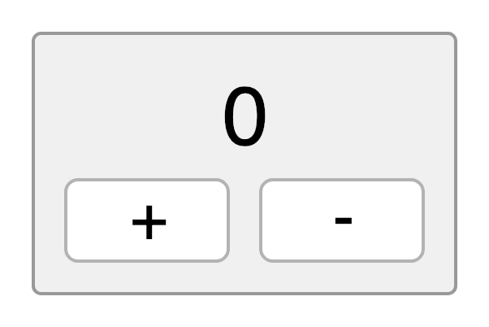
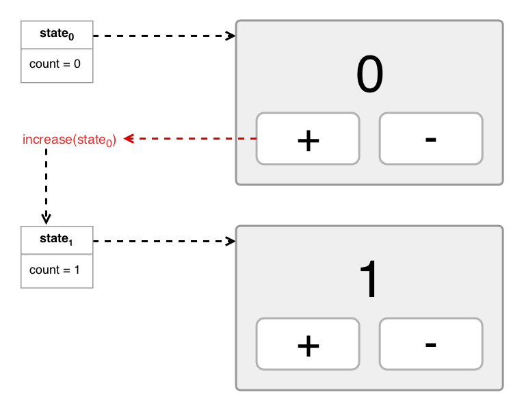
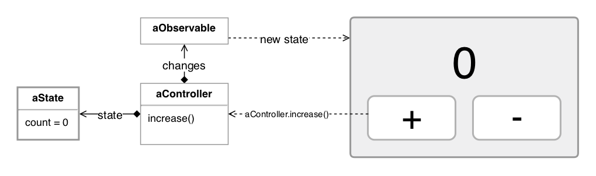

# Rinter

Rinter it's a minimalist state container based on [reactive extensions].

## Installation

Rinter requires [RxJS] as peer-dependency.

To install it using [NPM]:

```shell
npm install --save rinter rxjs
```

To install it using [Yarn]:

```shell
yarn add rinter rxjs
```

## Getting started

Rinter is similar to [Redux], [MobX] or [Vuex]: it allows you to handle the
application state in a centralized and predictable way.

To get started we are going to follow the usual example of a number (aka
"Counter"). Imagine an application that shows a number and two actions: increase
and decrease.



An immutable object describes the application state. And the actions generates a
new instance of the application state:



Rinter represents this architecture with an object called [Controller]. A
controller has a `state` property that returns the current state value. It also
has methods to modify the state. The view is able to detect changes by the
`changes` property.



In code:

```js
const counter = controller({
  mutators: {
    increase(state) {
      return state + 1;
    },
    decrease(state) {
      return state - 1;
    },
  },
});

const appCounter = counter(0);

appCounter.subscribe(state => {
  // renderView is an example of how the view will respond to state
  // changes and send callbacks to update the state
  renderView(state, {
    onIncreaseClick: appCounter.increase,
    onDecreaseClick: appCounter.decrease,
  });
});
```

## API reference

### Functions

- [controller]
- [compose]
- [debug]

### Classes

- [DefaultController]
- [CompositeController]

## Troubleshooting

### Log state changes

The [Observable] returned by the `changes` property can be used to trace state
changes:

```js
import { tap } from 'rxjs/operators';

// ...
const changes = controller.changes.pipe(tap(v => console.log(v)));
// subscribe to changes instead of controller.changes
```

However, setting up this in an app that passes references to the controller
instead to the observer can be annoying. The good news is that you can use the
[debug] utility function to create a proxy to trace state changes:

```js
import { debug } from 'rinter';

const controller = debug(new MyApp(), {
  stateChange(value) {
    console.log(value);
  },
});
```

By default, [debug] will be verbose logging every state change, but you can mute
it without having to configure all the options:

```js
import { debug } from 'rinter';

const controller = debug(new MyApp(), debug.SILENT);
```

### Multiple subscribers

Both `DefaultController` and `CompositeController` are going to generate an
error if you try to subscribe to `changes` multiple times without unsubscribing:

```js
const subscription = controller.changes.subscribe(v => {
  /*... */
});

// The observable is going to generate an error.
// Note that per RxJS design subscribe doesn't throw an exception,
// it emits an error event.
const otherSubscription = controller.changes.subscribe(
  v => {
    /*... */
  },
  () => {
    /* error! you must call subscription.unsubscribe() first */
  }
);
```

That behavior is by design. On a front-end app, you usually have only one
subscriber: the view. If you need to broadcast changes use the [RxJS]'s
`share()` operator:

```js
import { share } from 'rxjs/operators';

const changes = controller.changes.pipe(share());

// now you can subscribe to changes multiple times
```

### Big bundle size

Rinter itself is small, but [RxJS] is a big module. If your bundle size is big,
make sure to use a bundler that supports ES6 modules and does [tree-shaking] to
remove unnecessary code. For example, [Webpack] 4+ or [Rollup] supports that,
but Webpack 3 doesn't.

## License

MIT

[reactive extensions]: https://github.com/ReactiveX/rxjs
[rxjs]: https://github.com/ReactiveX/rxjs
[npm]: https://www.npmjs.com/
[yarn]: https://yarnpkg.com/
[redux]: https://redux.js.org/
[mobx]: https://mobx.js.org/
[vuex]: https://vuex.vuejs.org/
[observable]: http://reactivex.io/documentation/observable.html
[tree-shaking]: https://webpack.js.org/guides/tree-shaking/
[webpack]: https://webpack.js.org
[rollup]: https://rollupjs.org/
[controller]: ./docs/reference/functions/controller.md
[compose]: ./docs/reference/functions/compose.md
[debug]: ./docs/reference/functions/debug.md
[defaultcontroller]: ./docs/reference/classes/DefaultController.md
[compositecontroller]: ./docs/reference/classes/CompositeController.md
