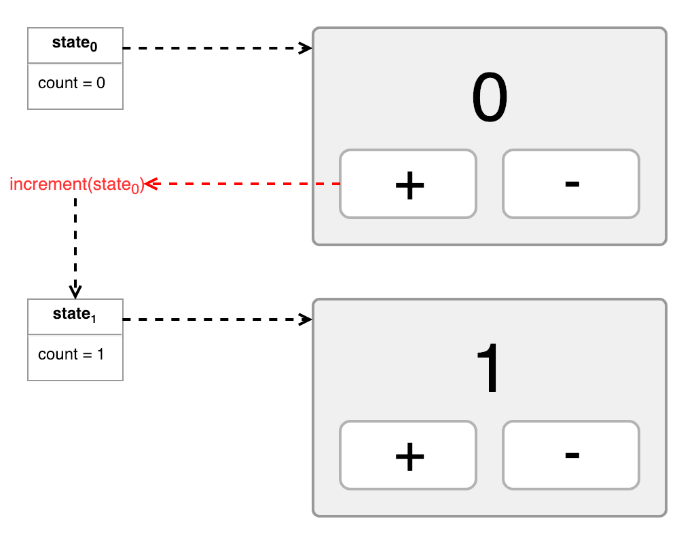
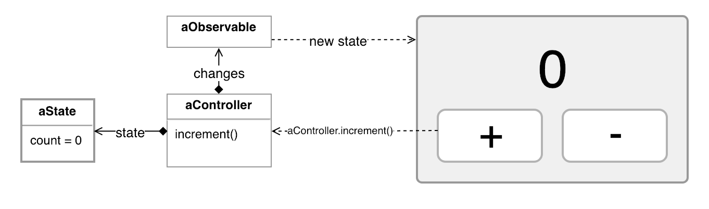

# Rinter

Rinter is a minimalist state container based on [reactive extensions].

## Installation

```shell
yarn add rinter rxjs
```

## Getting Started

Rinter is similar to [Redux], [MobX] or [Vuex]: it handles the application state
in a centralized and predictable way.

To get started we are going to follow the usual example of incrementing or
decrementing a number (aka "Counter").


An immutable object describes the application state. And the actions generate a
new instance of the application state:



Rinter represents this architecture with an object called
[Controller][controller interface]. A controller has a `state` property that
returns the current state value. It also has methods to modify the state. The
view is able to detect changes by the `changes` property.



Code (using the [controller] function):

```js
const counter = controller({
  initialState: { count: 0 },

  mutators: {
    increment: state => ({ count: state.count + 1 }),
    decrement: state => ({ count: state.count - 1 }),
  },
});

const appCounter = counter();

appCounter.changes.subscribe(state => {
  // renderView is an example of how the view will respond to state
  // changes and send callbacks to update the state
  renderView(state, {
    onIncrementClick: appCounter.increment,
    onDecrementClick: appCounter.decrement,
  });
});
```

The [controller] function is a shortcut to write less code. If you prefer ES6
classes you can create a [Controller][controller interface] by sub-classing
[DefaultController]:

```js
class Counter extends DefaultController {
  constructor(initialValue = { count: 0 }) {
    super(initialValue);
  }

  increment() {
    this.set({ count: this.state.count + 1 });
  }

  decrement() {
    this.set({ count: this.state.count - 1 });
  }
}

const appCounter = counter();

appCounter.changes.subscribe(state => {
  renderView(state, {
    onIncrementClick: () => appCounter.increment(),
    onDecrementClick: () => appCounter.decrement(),
  });
});
```

## Controller Composition

As your application grows, you may want to compose multiple controllers into
one. The [compose] function does that:

```js
const twoCounters = compose({
  a: counter,
  b: counter,
});

const controller = twoCounters();
console.log(controller.state); // {a: {count: 0}, b: {count:0}}

controller.a.increment();
console.log(controller.state); // {a: {count: 1}, b: {count:0}}
```

## API Reference

### Functions

- [controller]
- [compose]
- [debug]

### Classes

- [DefaultController]
- [CompositeController]

## Troubleshooting

### Log State Changes

The [Observable] returned by the `changes` property can be used to trace state
changes:

```js
controller.changes.subscribe(state => console.log(state));
```

However, setting up this in an app can be annoying. The good news is that you
can use the [debug] utility function to trace state changes:

```js
import { debug } from 'rinter';
//...
debug(controller);
```

By default, [debug] will log every state change, but you can mute it:

```js
debug(controller, debug.SILENT);
```

Also you may want to customize the logging behavior:

```js
debug(controller, {
  stateChange(value) {
    myCustomLogFunction(value);
  },
});
```

The debug function returns the controller that you pass to it:

```js
const controller = debug(createController());
```

If you pass a controller factory function, debug will detect it and return a
factory function too:

```js
const createController = debug(initialCreateController);
const controller = createController();
```

Which is handy when using [compose]:

```js
const twoCounters = compose({
  a: debug(counter),
  b: counter,
});
```

### Bundle Size

Rinter itself is small, but [RxJS] is a big module. If your bundle size is big,
make sure to use a bundler that supports ES6 modules and does [tree-shaking] to
remove unnecessary code. For example, [Webpack] 4+ or [Rollup] supports that,
but Webpack 3 doesn't.

## License

MIT

[reactive extensions]: https://github.com/ReactiveX/rxjs
[rxjs]: https://github.com/ReactiveX/rxjs
[redux]: https://redux.js.org/
[mobx]: https://mobx.js.org/
[vuex]: https://vuex.vuejs.org/
[observable]: http://reactivex.io/documentation/observable.html
[tree-shaking]: https://webpack.js.org/guides/tree-shaking/
[webpack]: https://webpack.js.org
[rollup]: https://rollupjs.org/
[controller]: ./docs/reference/functions/controller.md
[controller interface]: ./docs/reference/interface/controller.md
[compose]: ./docs/reference/functions/compose.md
[share]: ./docs/reference/functions/share.md
[debug]: ./docs/reference/functions/debug.md
[defaultcontroller]: ./docs/reference/classes/DefaultController.md
[compositecontroller]: ./docs/reference/classes/CompositeController.md
